# SignHope_ASL_Classification_Application

## Application 
Sign Hope is a sign language classification system that recognizes gestures for both alphabets and words in American Sign Language (ASL). This project was developed as a Final Year Project (FYP) and consists of a web app for basic sign language recognition and an advanced mobile app with multiple additional features.

The machine learning model powering Sign Hope can classify 29 alphabet signs with an accuracy of 98%, and 20 word-level signs with 72% accuracy. The system includes various interactive features such as live camera recognition, video tutorials, and a chatbot for learning and communication assistance.

    
    
    

## Technology 

1. Figma for UX/UI
2. Firebase
3. Google Authentication
4. Android Studio ( Kotlin , Java and XML) for Mobile Application
5. Web Application ( Html, CSS , JS )
6. FastAPI Server 
7. Python for Machine Learning models
8. Kaggle for Dataset

# System Architecture 

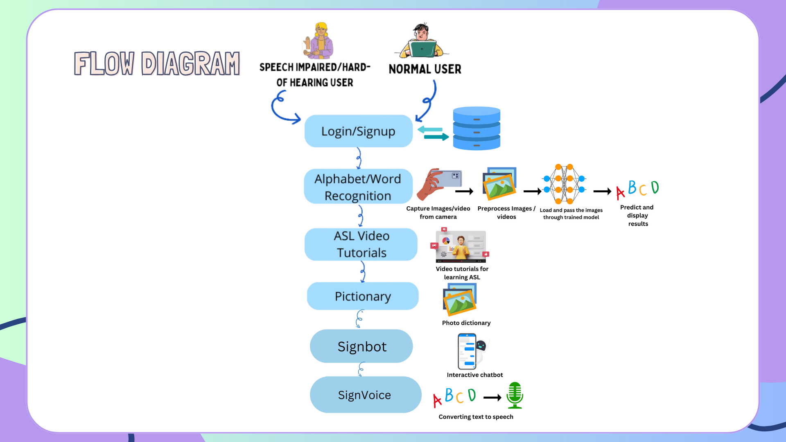

# System Designing 
The system was designed on Figma first. ( click on the Image to see full design). 
[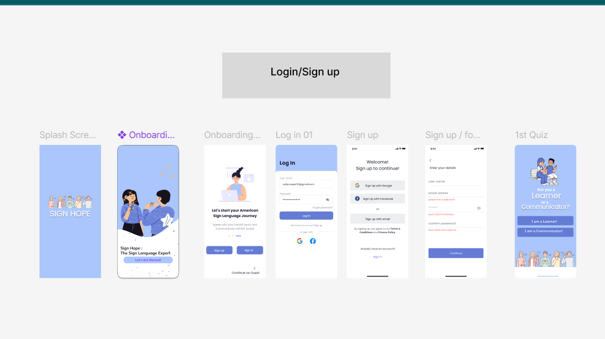](https://www.figma.com/design/eJvRlb1nvZ6vnO8qkVHUOE/SignHope?node-id=0-1&t=UFLASXXYxIiZgJkd-1)

### Web Application Features:
1. **Sign Language Recognition**: The web app enables users to recognize basic alphabet signs from the ASL alphabet.
2. **User-friendly Interface**: Built using HTML and CSS with simple navigation.

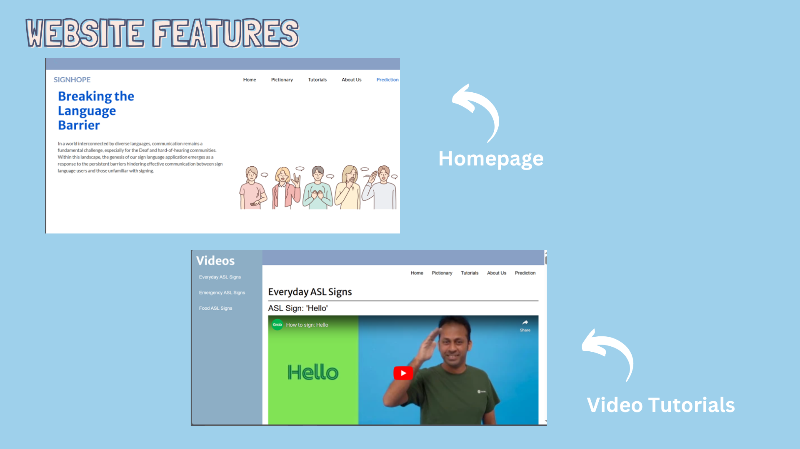

3. **Deployed on Netlify**: The web app is available for use online via Netlify.

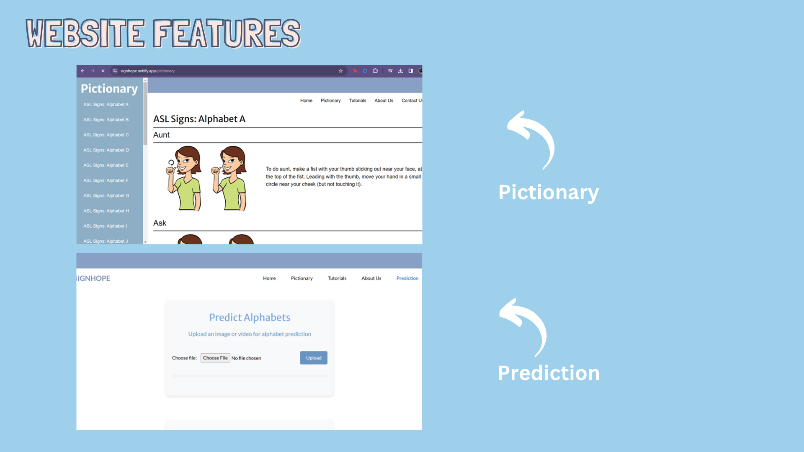

## Mobile Application Features:

The SignHope Application is designed and made on XML, Java and Android Studio. 

1. **Camera Recognition**: Real-time sign recognition using the device’s camera. Powered by OpenCV and integrated with TensorFlow Lite, this feature enables real-time sign recognition directly through the device’s camera. The model processes live video frames, detects hand regions, and classifies the sign being performed, allowing users to practice ASL interactively with instant visual feedback.

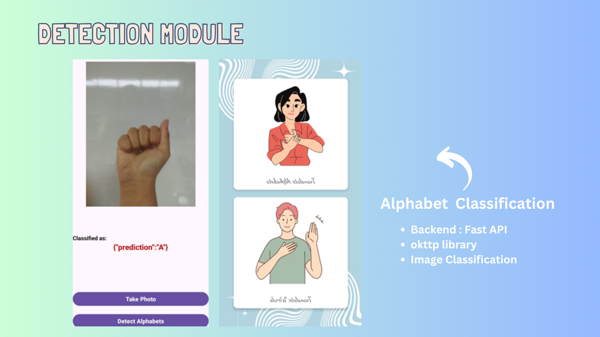

2. **Pictionary**: Interactive game that helps users learn and practice ASL through images and signs. Designed for educational purposes, the Pictionary mode turns learning into a game. Users match signs with images to reinforce their understanding of ASL vocabulary in a fun and engaging way, promoting visual memory and retention.

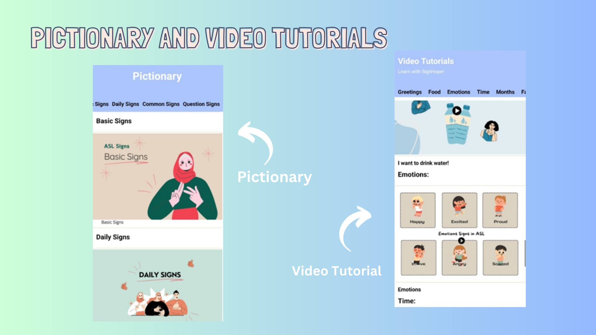

3. **Video Tutorials**: A series of instructional videos to help users learn ASL at their own pace. A built-in video library provides step-by-step tutorials, helping users learn ASL at their own pace. Each lesson focuses on clear, demonstrative signing for both alphabets and common words.

4. **Sign Bot (Chatbot)**: An AI-powered chatbot to assist users with queries and guide them through the application. An intelligent chatbot powered by Google Gemini Flash guides users through the app, answers ASL-related questions, and offers personalized learning suggestions. It provides conversational assistance, making the app feel like an interactive tutor.

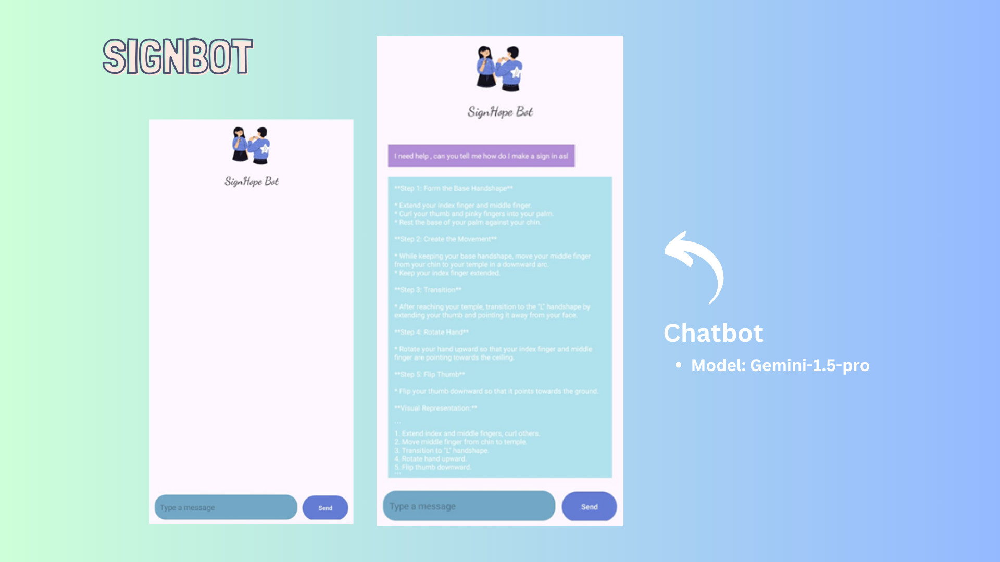

5. **Google Authenticator Integration**: Secured user authentication using Google Authenticator.Ensures secure user authentication through two-factor verification, adding an extra layer of protection to user accounts.

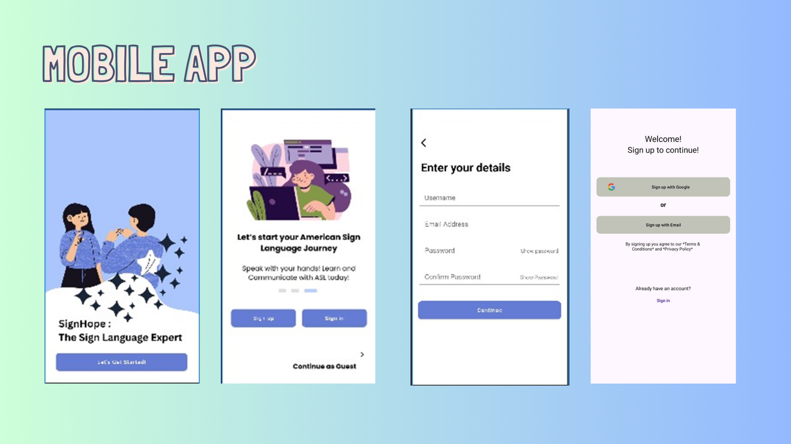

6. **Firebase Database**: Firebase is used for storing user data and managing authentication. The app uses Google Firebase for real-time data synchronization, user management, and secure cloud storage of preferences and progress, ensuring a consistent experience across devices.

7. **Google Text-to-Speech (TTS)**: The application integrates Google Text-to-Speech to provide audio feedback for recognized signs and chatbot responses. This feature enhances accessibility by converting text outputs into natural-sounding speech, allowing users to hear pronunciations and instructions while learning ASL. It creates a more immersive and inclusive learning experience, especially for beginners and visually oriented learners.

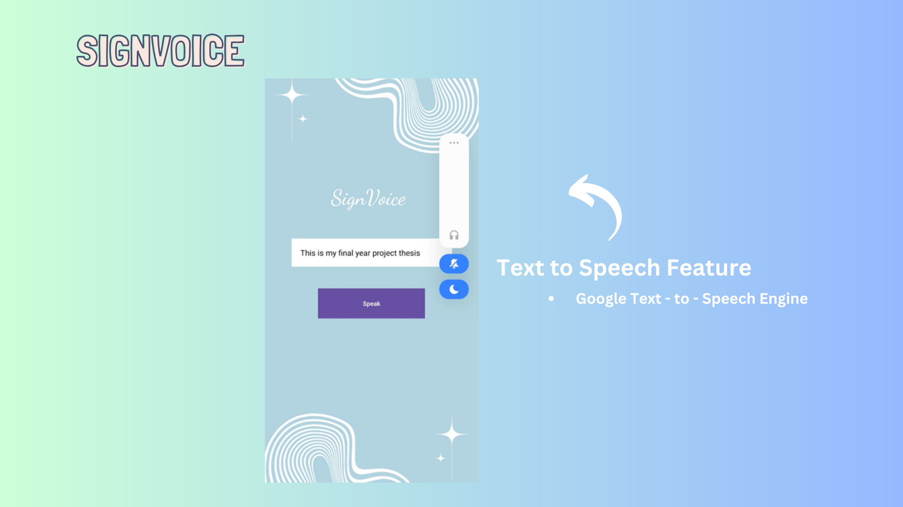

## Architecture
The project architecture is divided into two main components:
1. **Web App**: Developed using HTML and CSS for basic ASL alphabet recognition. Deployed on Netlify.
2. **Mobile App**: A more sophisticated application with multiple features and machine learning integration.

## Machine Learning Models
The Sign Hope system is powered by multiple deep learning models trained to recognize American Sign Language (ASL) gestures at both the alphabet and word levels. All models were developed and fine-tuned using TensorFlow and Keras, ensuring high accuracy and real-time performance for both static and dynamic sign recognition tasks.

For alphabet-level classification, a 2D Convolutional Neural Network (CNN) was trained on 29 ASL alphabet signs. This model specializes in identifying static hand gestures and achieved an impressive 98% accuracy. It forms the foundation of the system’s letter recognition capability, providing instant feedback for users learning individual ASL letters.

To handle word-level classification, a 3D CNN architecture was employed to analyze spatio-temporal features from short video clips. This model captures both motion and depth information, making it effective for dynamic gestures such as “hello,” “thank you,” “yes,” and “no.” It reached a 72% accuracy, demonstrating strong generalization for real-world use cases.

The classification model used for Sign Hope was trained using TensorFlow and Keras, and it achieved the following performance:

1. **Alphabet-Level Classification**:
     - 29 ASL alphabet classes
     - 98% accuracy
2. **Word-Level Classification**:
      - 20 ASL word classes (commonly used signs such as "hello," "thank you," "yes," "no," etc.)
      - 72% accuracy

| Model           | Description                                   | Use Case                                             |
| --------------- | --------------------------------------------- | ---------------------------------------------------- |
| **YOLOv5**      | Real-time hand detection and ROI extraction   | Pre-processing pipeline for gesture isolation        |
| **MobileNetV2** | Lightweight CNN for edge deployment           | On-device classification with low latency            |
| **InceptionV3** | Deep CNN for high-accuracy feature extraction | Benchmarking and comparison with lighter models      |
| **2D CNN**      | Baseline convolutional model                  | Fast training for static sign recognition            |
| **3D CNN**      | Temporal convolutional model                  | Captures motion and depth information in video signs |

   
Beyond these, Sign Hope integrates several other advanced architectures to enhance performance across different devices and environments. YOLOv5 is used for real-time hand detection and region-of-interest extraction, ensuring that only relevant hand gestures are passed to the classifier. MobileNetV2 enables lightweight, low-latency recognition on mobile or embedded devices, while InceptionV3 serves as a deeper feature extractor for benchmarking and comparison. Together, these models create a robust pipeline that balances speed, efficiency, and accuracy.

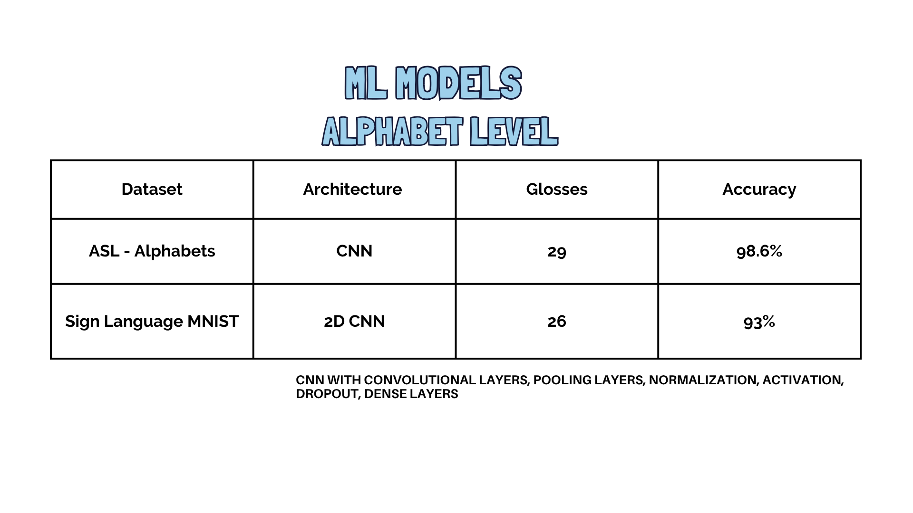

Each component plays a unique role in processing input frames, classifying gestures, and guiding users through interactive learning experiences. Whether identifying a single alphabet sign or interpreting full words from motion, the combined architecture helps users understand, practice, and master ASL with confidence.

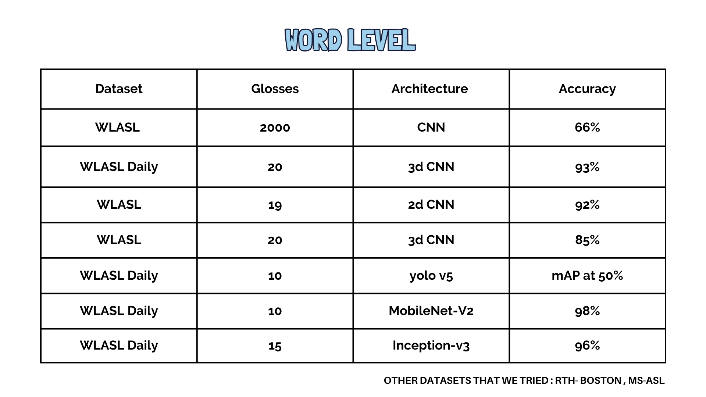

### My Contribution 

1. Idea 
2. Mobile App: Alphabet and word detection modules, chatbot, text-to-speech feature, dashboard
3. Website: landing page, model integration , Picture dictionary 
4. Backend: Server for Fast API for words and alphabet modules 
5. Machine Learning Models: CNN, 2D CNN , 3D CNN, yolo v5
6. Dataset: Contributed to synthesizing the dataset
7. Other: Logo and theme designing, model architectures

---

## Project Screenshots

Here are some screenshots showcasing the Sign Hope application in action:

    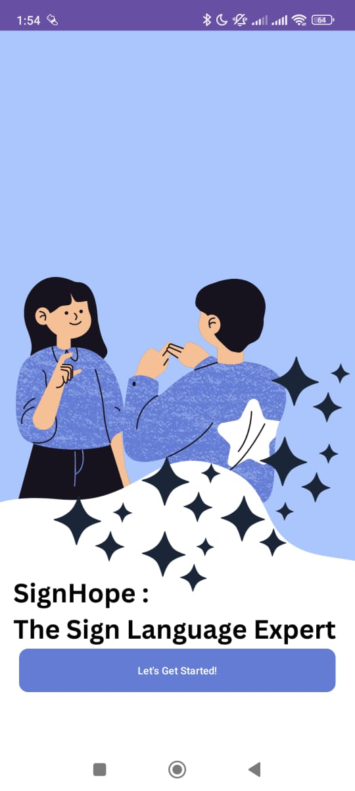
    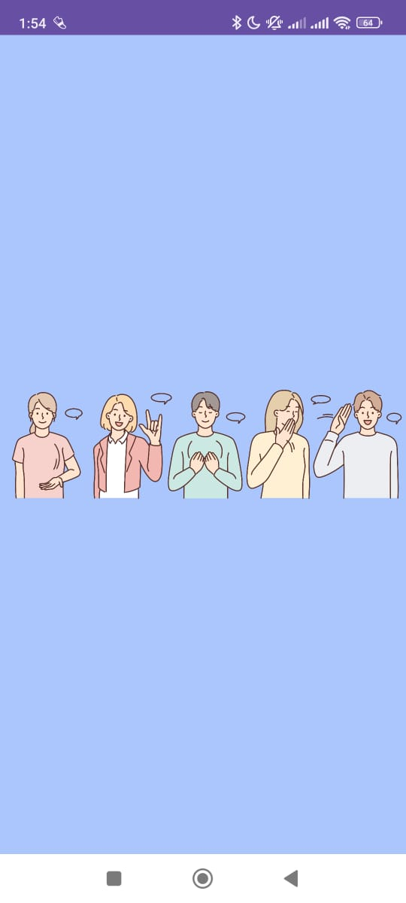
    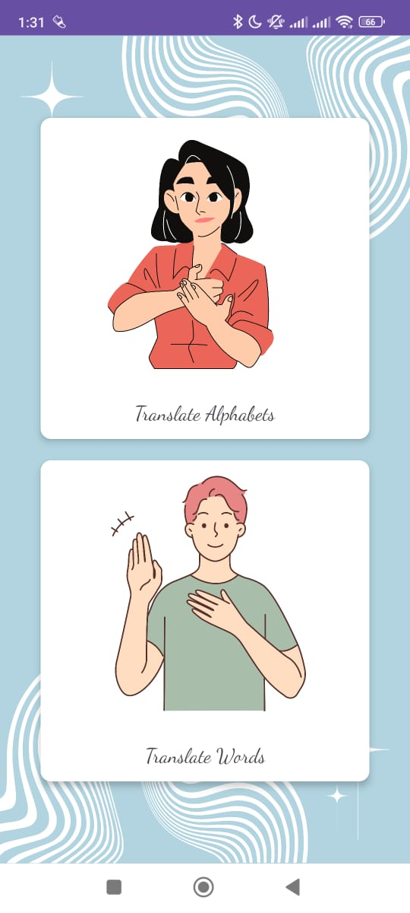

    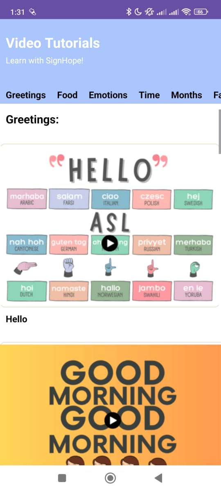
    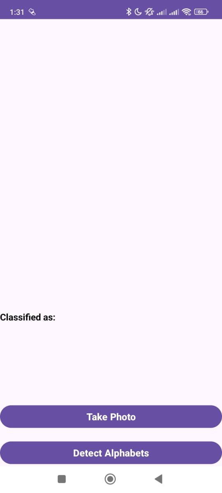
    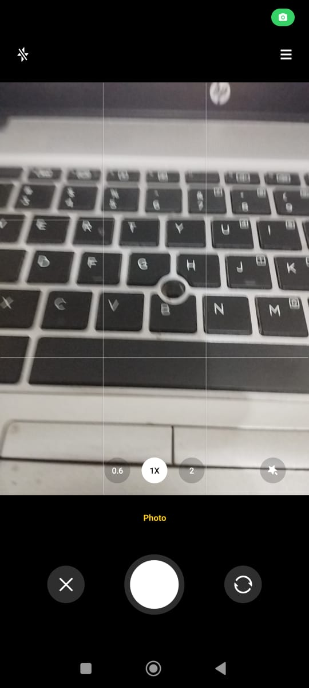

## Web Application

Here’s a video showcasing the Sign Hope application in action:

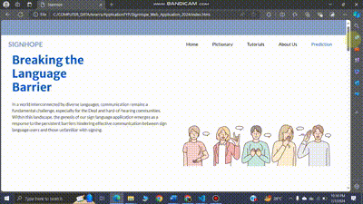

