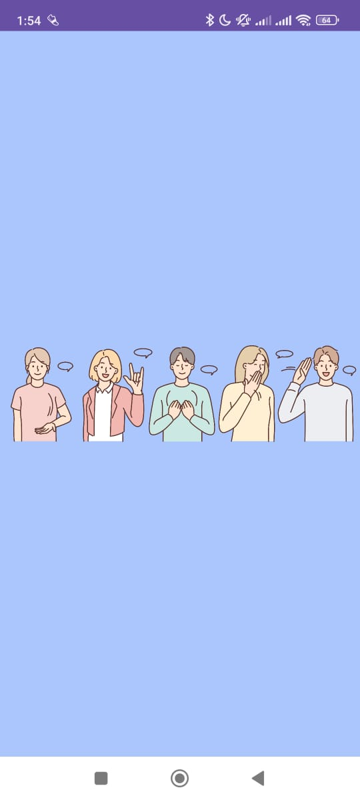

# SignHope_ASL_Classification_Application

## Background 
The idea for SignHope ASL Classification Application originated from an experience I had while dining at a local restaurant, where I noticed a speech and hearing-impaired waiter communicating with customers using a set of printed cards with common phrases and questions. Although this method was functional, it seemed cumbersome and limited, highlighting how communication, a fundamental part of human interaction, can become an obstacle. Inspired by this, I saw an opportunity to use technology and AI to bridge the communication gap for speech and hearing-impaired individuals. This led to the development of SignHope, an application that uses machine learning to classify American Sign Language gestures, enabling seamless communication between those with hearing and speech impairments and others. This project is a technical challenge and a mission to empower individuals with disabilities, eliminate communication barriers, and foster inclusivity and understanding in everyday interactions. This project works on the following UN-SDGs

    
    
    

## Application 
Sign Hope is a sign language classification system that recognizes gestures for both alphabets and words in American Sign Language (ASL). This project was developed as a Final Year Project (FYP) and consists of a web app for basic sign language recognition and an advanced mobile app with multiple additional features.

The machine learning model powering Sign Hope can classify 29 alphabet signs with an accuracy of 98%, and 20 word-level signs with 72% accuracy. The system includes various interactive features such as live camera recognition, video tutorials, and a chatbot for learning and communication assistance.

##Technology 

### Web Application:
1. **Sign Language Recognition**: The web app enables users to recognize basic alphabet signs from the ASL alphabet.
2. **User-friendly Interface**: Built using HTML and CSS with simple navigation.
3. **Deployed on Netlify**: The web app is available for use online via Netlify.

### Mobile Application:
1. **Camera Recognition**: Real-time sign recognition using the device’s camera.
2. **Pictionary**: Interactive game that helps users learn and practice ASL through images and signs.
3. **Video Tutorials**: A series of instructional videos to help users learn ASL at their own pace.
4. **Sign Bot (Chatbot)**: An AI-powered chatbot to assist users with queries and guide them through the application.
5. **Google Authenticator Integration**: Secured user authentication using Google Authenticator.
6. **Firebase Database**: Firebase is used for storing user data and managing authentication.

### Architecture
The project architecture is divided into two main components:
1. **Web App**: Developed using HTML and CSS for basic ASL alphabet recognition. Deployed on Netlify.
2. **Mobile App**: A more sophisticated application with multiple features and machine learning integration.

### Machine Learning Models
The classification model used for Sign Hope was trained using TensorFlow and Keras, and it achieved the following performance:

1. **Alphabet-Level Classification**:
     - 29 ASL alphabet classes
     - 98% accuracy
2. **Word-Level Classification**:
      - 20 ASL word classes (commonly used signs such as "hello," "thank you," "yes," "no," etc.)
      - 72% accuracy
   
The model processes input frames and classifies them into the respective alphabet or word class. For video tutorials and pictionary, the model helps guide users in understanding and learning these signs.

---

## Project Screenshots

Here are some screenshots showcasing the Sign Hope application in action:

    
    
    

    
    
    

## Web Application

Here’s a video showcasing the Sign Hope application in action:

